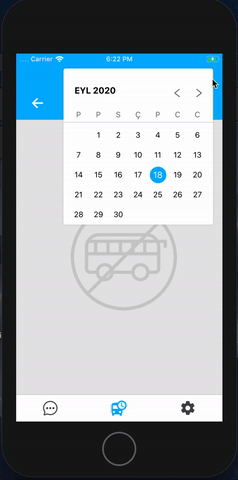

# React Native Material Date Picker Component


## :star: ScreenShot



## :arrow_down: Installation

#### Install from npm

```sh
npm install --save react-native-material-date-picker

or

yarn add react-native-material-date-picker
```


#### The usage (Step 2)

```sh
import { ModalDatePicker } from "react-native-material-date-picker";

const App = () => {
  return (             
      <View style={{flex: 1, alignSelf: 'stretch'}}>
        <ModalDatePicker 
            button={<Text> Open </Text>} 
            locale="tr" 
            onSelect={(date) => console.log(date) }
            isHideOnSelect={true}
            initialDate={new Date()}
        />             
      </View>
  );
};
```


##  Config

| Params | Type | Default | Description |
| --- | --- | --- | --- |
| locale | string | en | Language of the picker |
| color | string | #00B0FF | The selected date color |  
| style | Style | - | Style of the picker container |
| onSelect | func | - | Run after selection of a date |
| onForward | func | - | Run after go forward a day |
| onBack | func | - | Run after go back a day |
| onHidden | func | - | Run after hidden the picker (only ModalDatePicker) |
| isHideOnSelect | boolean | false | Determines whether the modal will be closed (only ModalDatePicker) |
| initialDate | Date | Now | Initial date for picker (only ModalDatePicker) |


## :warning: Dependency

### Note on the legacy CLI
There seems to be quite some confusion about the legacy CLI. This template only works with the new CLI. Make sure you have uninstalled the legacy `react-native-cli` first (`npm uninstall -g react-native-cli`), for the below command to work. If you wish to not use `npx`, you can also install the new CLI globally (`npm i -g @react-native-community/cli` or `yarn global add @react-native-community/cli`).
